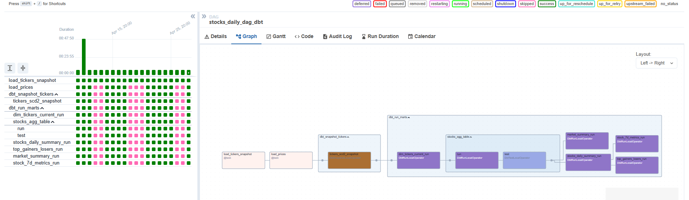

=======
# 📈 Stock Market Data Engineering Pipeline

This project builds a production-ready stock market data pipeline that extracts daily stock price snapshots, loads them into Snowflake, and models the data using dbt for analytics and dashboarding.

---

## 🚀 Tech Stack

- **Airflow** (with Astronomer Cosmos)
- **dbt** (Data Build Tool for transformations)
- **Snowflake** (Cloud Data Warehouse)
- **Polygon.io API** (Daily stock market data)
- **Python**
- **.env-based secrets loading**

---

## ⚙️ Pipeline Overview

- Daily data pulled from Polygon API
- Stored in Snowflake (`stock_prices` + `tickers`)
- dbt transforms and snapshots historical metadata
- Aggregated marts for analytics and dashboarding
- Skips holidays / non-trading days with `AirflowSkipException`
- Partitioned tables + incremental models for performance

---

## 🧠 Key Features

✅ Daily stock ingestion with Airflow  
✅ Incremental & partitioned dbt models  
✅ Historical ticker snapshots with `dbt snapshot`  (SCD2)
✅ Aggregated marts for dashboarding:  
&nbsp;&nbsp;&nbsp;&nbsp;• Market Summary  
&nbsp;&nbsp;&nbsp;&nbsp;• Daily Metrics  
&nbsp;&nbsp;&nbsp;&nbsp;• Gainers/Losers  
&nbsp;&nbsp;&nbsp;&nbsp;• 7D Metrics
✅ Cosmos-managed `DbtTaskGroup`  
✅ Modular code + reusable pipeline

---

## 📊 DAG Graph View

This is how the pipeline orchestrates daily tasks using Airflow:

> `load_prices` and `load_tickers_snapshot` pull data →  
> `dbt_run_marts` transforms raw data to marts via dbt  
> (including snapshots, aggregations, and tests)

---

